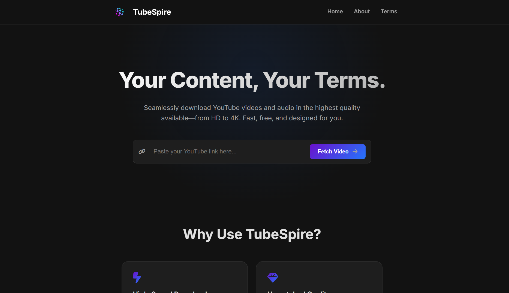

 

### **A High-Performance Engine for Seamless YouTube Media Archiving.**

  
  
  
  

**TubeSpire** is not just another downloader—it's a robust, self-hosted engine engineered for elite media archiving. Forged with a focus on raw performance, absolute privacy, and a minimalist user experience, it provides a clean, powerful gateway to YouTube's media library, free from ads and trackers.

---

### 📚 Table of Contents
1. [**The Philosophy**](#-the-philosophy)
2. [**Live Demo**](#-live-demo)
3. [**Core Features**](#-core-features)
4. [**Technical Architecture**](#-technical-architecture)
5. [**Technology Stack**](#-technology-stack)
6. [**Deployment & Setup**](#-deployment--setup)
7. [**Frequently Asked Questions**](#-frequently-asked-questions)
8. [**Contributing**](#-contributing)
9. [**License**](#-license)

---

> _A tool forged in the fires of digital sovereignty._

## 🔥 The Philosophy

This project is built on an uncompromising foundation.

- **🚀 UNCOMPROMISING SPEED:** Engineered for pure velocity. A lightweight Flask backend and efficient processing pipeline mean your downloads are handled with minimal overhead.
- **✨ RADICAL SIMPLICITY:** Power doesn't require complexity. The UI is brutally efficient and intuitive, designed to serve your needs and then get out of the way.
- **🛡️ ABSOLUTE PRIVACY:** Your operations are your own. TubeSpire's core application operates on a zero-log policy for user downloads. No user accounts, no download history.

<a href="#-table-of-contents">↑ back to top</a>

---

## 📸 Live Demo

A glimpse into the clean, focused, and powerful user interface of TubeSpire.

  

**Watch the Video Demo**

<a href="#-table-of-contents">↑ back to top</a>

---

## 💎 Core Features

| Feature                 | The Arsenal                                                                                                             |
| :---------------------- | :---------------------------------------------------------------------------------------------------------------------- |
| 💿 **2K & 4K Video** | Archive video in resolutions up to pristine 4K UHD. Your media, preserved in its highest form.                          |
| 🎵 **High-Bitrate Audio** | Rip and convert audio streams directly to high-bitrate MP3. Perfect for music, podcasts, and critical audio analysis.   |
| ⚡ **Efficient Backend** | Built on a high-throughput Flask architecture that handles requests with ruthless efficiency for a zero-lag experience. |
| 🕶️ **Minimalist UI/UX** | A sleek, fully responsive interface with a native dark mode that's easy on the eyes and hard on distractions.         |
| 🔒 **Zero-Log Privacy** | With zero user tracking and no request logging, TubeSpire is your secure, private media archiving vault.                |

<a href="#-table-of-contents">↑ back to top</a>

---

## 🧠 Technical Architecture

TubeSpire is engineered with a clean, decoupled architecture for maximum performance and maintainability.

1.  **Frontend:** A responsive UI built with semantic **HTML5** and modern **CSS3**, powered by lightweight, vanilla **JavaScript**.
2.  **Backend:** A **Flask** application (`app.py`) serves as the central nervous system, handling all routing and business logic.
3.  **Download Engine:** The powerful **`yt-dlp`** library retrieves metadata and media streams, while **FFmpeg** handles the merging and conversion of files into high-quality MP4s and MP3s.

<a href="#-table-of-contents">↑ back to top</a>

---

## 🛠️ Technology Stack

  
  
  
  
  
   
  
  
  
  

<a href="#-table-of-contents">↑ back to top</a>

---

## 🚀 Deployment & Setup
For a complete guide on local setup, dependencies, and deployment, consult the **[Administrator's Guide](guide/ADMIN_GUIDE.md)**.

<a href="#-table-of-contents">↑ back to top</a>

---

## ❓ Frequently Asked Questions

<strong>Is using this software legal?</strong>

 
This software is a tool, and you are responsible for using it ethically. It is intended for the legitimate archival of public content (e.g., your own creations, public domain media). Do not use this tool for piracy or copyright infringement.

 

<strong>Why is FFmpeg required?</strong>

 
For high-resolution content (1080p and above), YouTube delivers video and audio as separate streams. FFmpeg is the industry-standard tool required to merge ("mux") these streams into a single, flawless file.

 

<strong>How is this better than online downloader websites?</strong>

 
Online sites are often filled with ads, trackers, and malware. TubeSpire is your own private, self-hosted instance. It is faster, safer, and respects your privacy.

<a href="#-table-of-contents">↑ back to top</a>

---

## 🤝 Contributing
We welcome contributions. Please consult the **[Contributing Guide](CONTRIBUTING.md)** for mission parameters and code of conduct.

  <h3>Project Architect</h3>
  <a href="https://github.com/KartikeyaPandey313">
    
     
    <b>Kartikeya Pandey</b>
  </a>

<a href="#-table-of-contents">↑ back to top</a>

---

## 📜 License
This project is governed by a **Proprietary License**. Access and use are granted exclusively by the author. Please review the full [LICENSE](LICENSE) file for details.

<a href="#-table-of-contents">↑ back to top</a>

  <em>“The best way to predict the future is to build it.”</em>
   
  <strong>© 2025 TubeSpire</strong>

